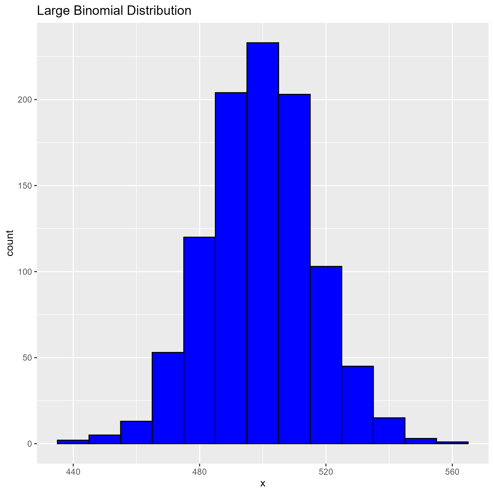
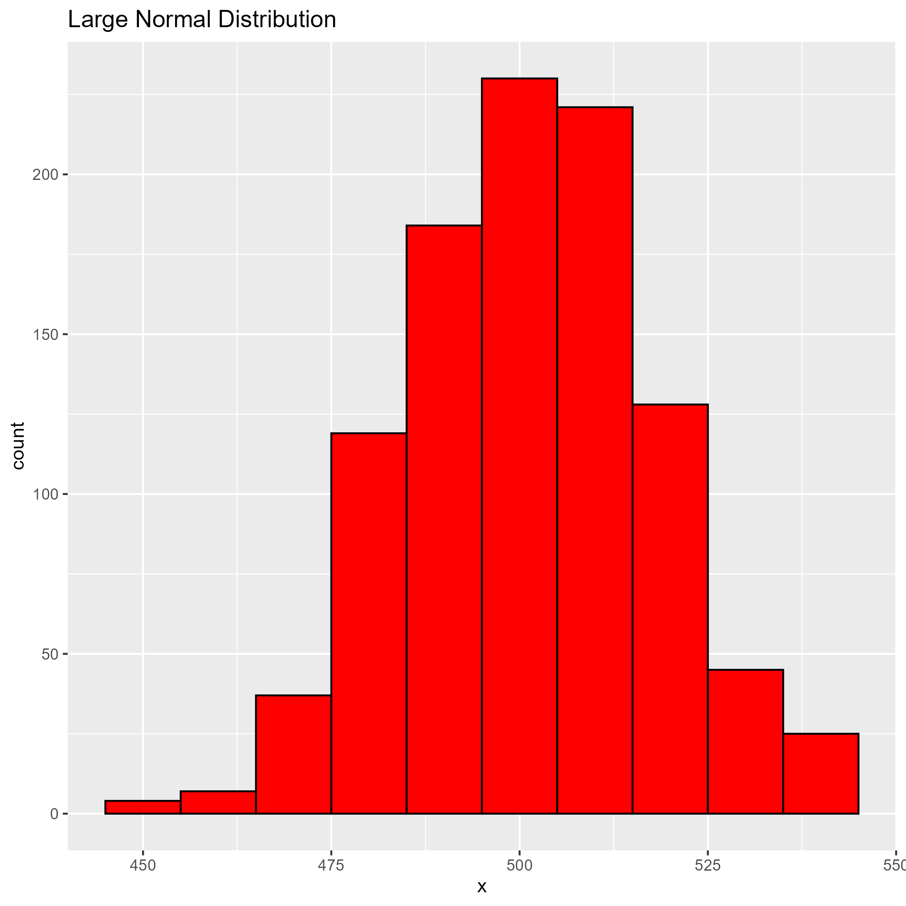

# Convergence of Binomial and Normal Distributions

## Binomial Distribution

## Poisson Distribution

## Normal Distribution

## Large Binomial Distribution

## Large Normal Distribution

### Proof
As the number of trials (N) increases, the Binomial distribution (for p = 0.5) approaches a Normal distribution. This is evident from the histograms which show the shape becoming more bell-like and symmetric.

### Hardware Survey Data Findings
The histograms and qualitative descriptions of the hardware survey data provide insights into the distributions and central tendencies of various features collected in the survey.

